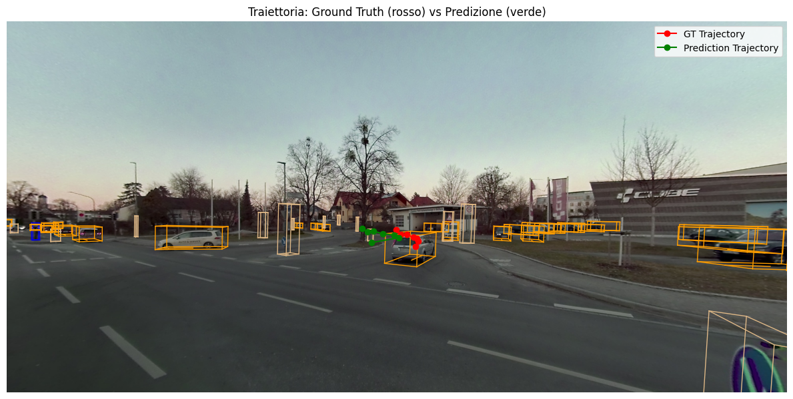

# 🚚 Trajectory Prediction in Truck Scenes


> **Predict the next 7 positions of the nearest moving vehicle given the first 3 observations**
> using the **TruckScenes‑Mini** dataset and a custom LSTM model.

This repository supports the report:
📄 *“Trajectory Prediction in Truck Scenes using LSTM under Incomplete Observations.”*

It includes:

* ✅ `Trajectory_Prediction.ipynb`: End‑to‑end Colab notebook (data prep → training → evaluation → visualization)
* 🧠 Pretrained models for three experiment settings
* 🛠 `train.py`: Unified script for training and evaluation
* 🔧 Helper scripts for dataset parsing and plotting
* 🗂 Preselected samples for easy qualitative evaluation

---

## 1 · 🚀 Quick Start (Google Colab)

Run everything from [**this Colab notebook**](https://colab.research.google.com/github/FrancescaPorcellii/Trajectory-Prediction/blob/main/Trajectory_Prediction.ipynb).

| Step                      | Command                                                                                                                                                                                                                                                                                                         |
| ------------------------- | --------------------------------------------------------------------------------------------------------------------------------------------------------------------------------------------------------------------------------------------------------------------------------------------------------------- |
| **1. Launch notebook**    | [Open in Colab](https://colab.research.google.com/github/FrancescaPorcellii/Trajectory-Prediction/blob/main/Trajectory_Prediction.ipynb)                                                                                                                                                                        |
| **2. Clone repository**   | `!git clone https://github.com/FrancescaPorcellii/Trajectory-Prediction.git`                                                                                                                                                                                                                                    |
| **3. Download dataset**   | Paste this in one cell:<br><br>`bash<br>!wget https://man-truckscenes.s3.eu-central-1.amazonaws.com/release/mini/man-truckscenes_metadata_v1.0-mini.zip<br>!wget https://man-truckscenes.s3.eu-central-1.amazonaws.com/release/mini/man-truckscenes_sensordata_v1.0-mini.zip<br>!unzip "man-truckscenes_*.zip"` |
| **4. Install dev-kit**    | `!pip install -U "truckscenes-devkit[all]"`                                                                                                                                                                                                                                                                     |
| **5. Initialise dataset** | `python<br>from truckscenes import TruckScenes<br>trucksc = TruckScenes('v1.0-mini', '/content/man-truckscenes/man-truckscenes', verbose=True)`                                                                                                                                                                 |

---

## 2 · 🧪 Experiments & Training

This project explores **three experimental setups**:

| Setting        | Description                                 | Training Flag  |
| -------------- | ------------------------------------------- | -------------- |
| `standard`    | All 10 time steps are present               | ` no`     |
| `drop_target` | One missing point in the **future segment** | `target` |
| `drop_input`  | One missing point in the **past segment**   | `input`  |

You can use the unified `train.py` script to either train a model from scratch or load pretrained models:

### ▶ Train a new model

```bash
model, debug_preds = train_model(samples, num_epochs=100, batch_size=4, lr=0.001, mode = "save", drop = 'target')
```

### 🔁 Load and evaluate pretrained model

```bash
model, debug_preds = train_model(samples, num_epochs=100, batch_size=4, lr=0.001, mode = "load", drop = 'target')
```

> All three pretrained models are already saved inside the `models/` directory.

---

## 3 · 📊 Visual Examples
Here's the updated **Visual Examples** section in proper GitHub README format, with image placeholders and clear descriptions of the visualization functions:

---

## 3 · 📊 Visual Examples

This project provides three built-in visualization tools to better understand model performance:

### 🟦 1. Cartesian Trajectory Plot

Visualizes the **past**, **ground-truth future**, and **predicted future** positions in the 2D cartesian space.

```python
visualize_trajectory(trucksc, debug_preds,first_ann_token, mode="global")
```

📍 Useful for understanding trajectory shape, especially for straight vs. curved motion.


---

### 🟥 2. Image-based Box Overlay

Renders the **ground-truth bounding boxes** and **predicted boxes** directly on the RGB image frame.

```python
render_box(trucksc, pred_seq, matched_sample)
```

📍 Ideal for observing spatial accuracy and vehicle positioning in the real scene.


---

### 🟩 3. Full Expected Trajectory

Draws the **complete predicted path** of the vehicle across all future frames.

```python
render_trajectory(trucksc, matched_sample, pred_seq)
```

📍 Useful for seeing how well the prediction aligns with the motion over time.




---

