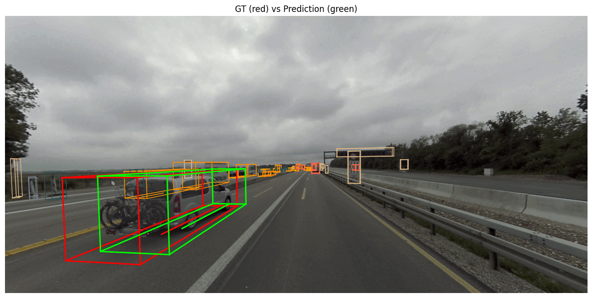

# Trajectory-Prediction

# Trajectory Prediction in Truck Scenes



> **Predict the next 7 positions of the nearest moving vehicle given the first 3 observations – with data from the *TruckScenes‑Mini* dataset.**

This repository accompanies the report *“Trajectory Prediction in Truck Scenes using LSTM under Incomplete Observations.”*  It contains:

* **`Trajectory_Prediction.ipynb`** – an end‑to‑end Colab notebook (data prep → training → evaluation → visualisation).
* Lightweight **helper scripts** for dataset parsing and plotting.

---

## 1 · Quick Start (Colab)

| Step                       | Command                                                                                                                                                                                                                                        |
|---------------------------|------------------------------------------------------------------------------------------------------------------------------------------------------------------------------------------------------------------------------------------------|
| **1. Clone repository**   | `!git clone https://github.com/FrancescaPorcellii/Trajectory-Prediction.git`                                                                                                                                                                  |
| **2. Download dataset**   | ```bash<br>!wget https://man-truckscenes.s3.eu-central-1.amazonaws.com/release/mini/man-truckscenes_metadata_v1.0-mini.zip <br>!wget https://man-truckscenes.s3.eu-central-1.amazonaws.com/release/mini/man-truckscenes_sensordata_v1.0-mini.zip <br>!unzip "man-truckscenes_*.zip"``` |
| **3. Install dev-kit**    | `!pip install -U "truckscenes-devkit[all]"`                                                                                                                                                                                                    |
| **4. Launch notebook**    | [Open in Colab](https://colab.research.google.com/github/FrancescaPorcellii/Trajectory-Prediction/blob/main/Trajectory_Prediction.ipynb)                                                                                                      |


Inside the notebook, initialise the dataset with:

```python
from truckscenes import TruckScenes
trucksc = TruckScenes('v1.0-mini', '/content/man-truckscenes/man-truckscenes', verbose=True)
```

---

---

## 2 · Experiments

The notebook (and the `experiments/` folder) reproduce the three scenarios described in the report:

1. **`standard/`** – fully observed samples.
2. **`drop_target/`** – one missing point in the future segment.
3. **`drop_input/`** – one missing point in the past segment.

Running a script builds the compatible samples, trains (or loads) the model, and logs metrics:

```bash
python experiments/run.py --exp drop_input --epochs 50
```

---

## 3 · Visual Examples

<div align="center">
  
  
  <br>
  <sub>Blue = past • Red = ground truth • Green = prediction</sub>
</div>

> Two annotation tokens (one straight, one curved) are pre‑selected in *`examples/preselected_annotations.json`* so you can reproduce the figures instantly.  Feel free to pick any other sample and re‑run the visualisation cells.

### Animated Demo


---

## 5 · Citation

```bibtex
@misc{porcelli2025lstm,
  author       = {Francesca Porcelli},
  title        = {Trajectory Prediction in Truck Scenes using LSTM under Incomplete Observations},
  year         = {2025},
  howpublished = {GitHub},
  url          = {https://github.com/FrancescaPorcellii/Trajectory-Prediction}
}
```

---

## 6 · Licence

Released under the MIT License – see `LICENSE` for details.
